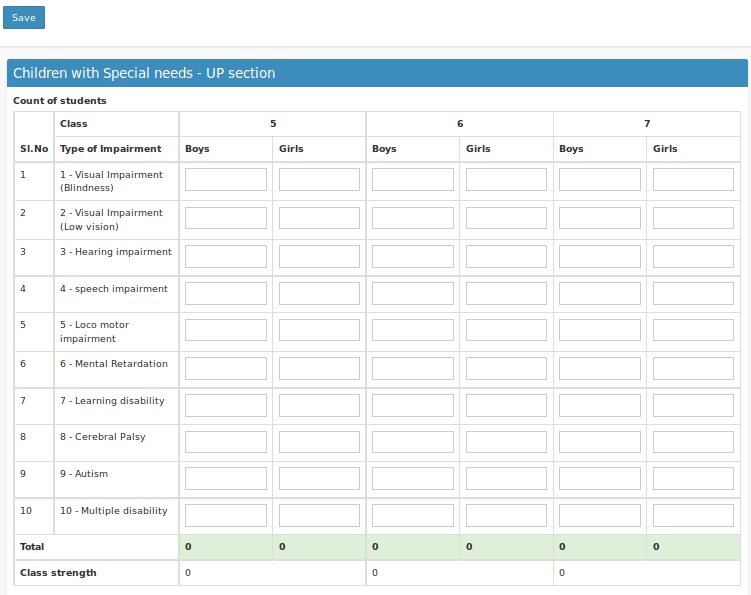

# Children with Special Needs
----

Form used to enter the details of childrens those who have special needs in the School. The form is divided into 4. i.e seperate form for LP, UP, Secondary and Higher Secondary.

### LP Section
-----

### UP Section
-----

### Secondary Section
-----

### Higher Secondary Section
-----

