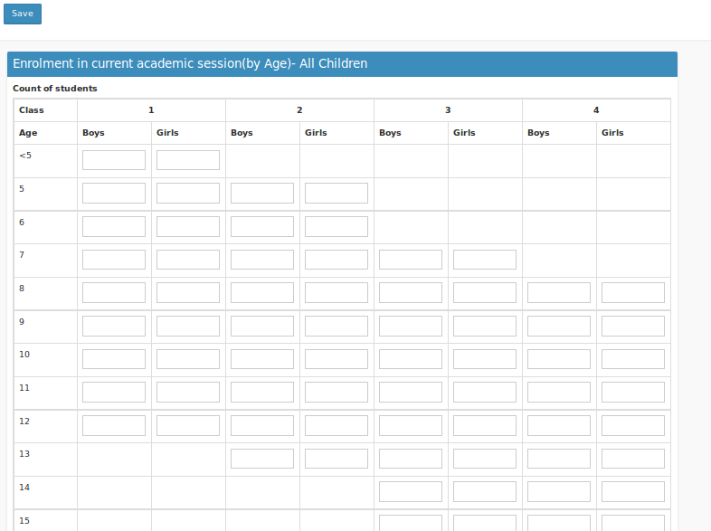
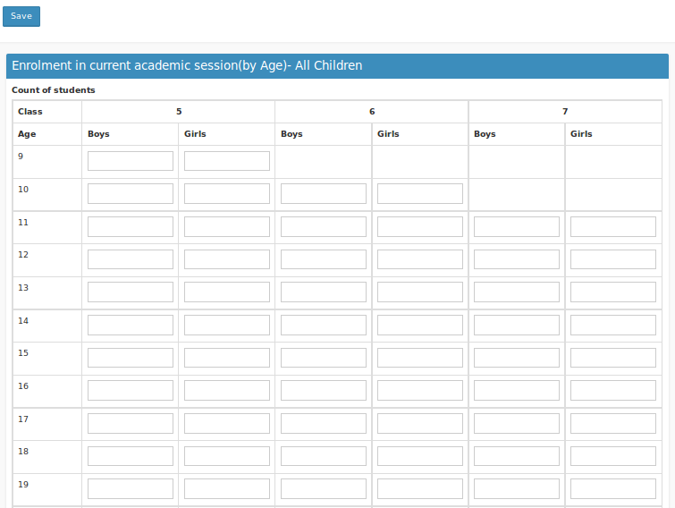
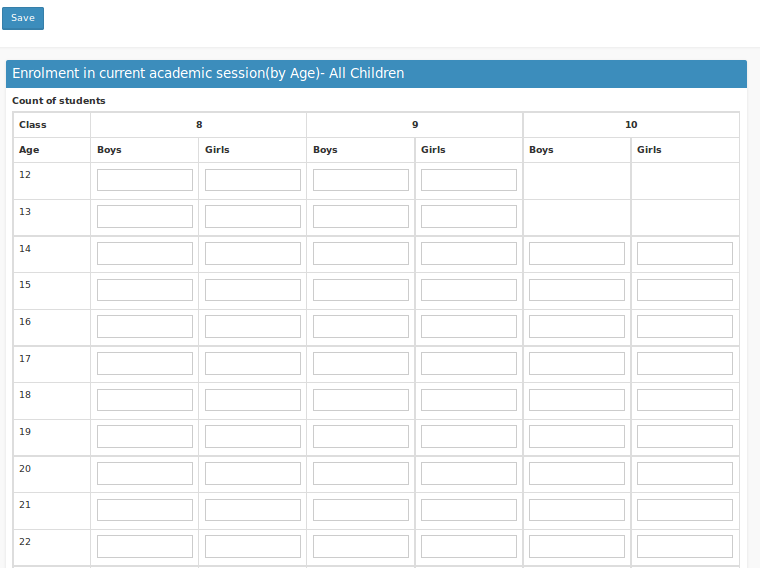
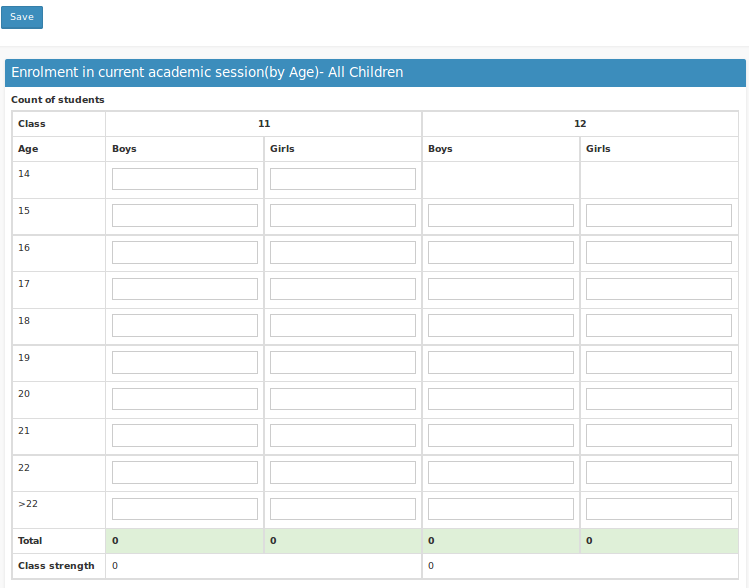

## Enrolment in current academic session(by Age) All children
----

To enter the enrolment details of Students under different age groups. For the sake of data entry the Form is divided into four. i.e seperate form for LP, UP, Secondary and Higher Secondary.

### LP Section
-------

### UP Section
-------

### Secondary Section
-------

### Higher Secondary Section
-------

