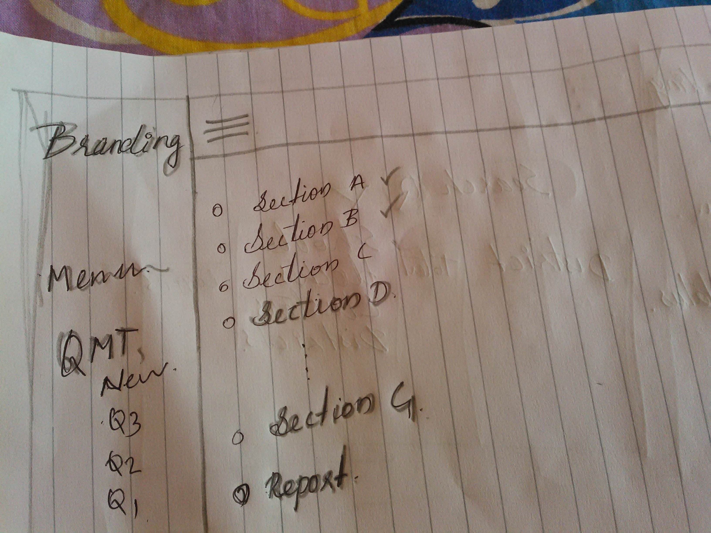

# Schooll Monitoring Format
First table in the Quality monitoring Format
Which is to be duly filled each quarter of the year.

**In this, what we planned to do is as follow.**

1. Deviding each section and name the same
2. Display forms in most convenient and user friendly mode.
3. easy to update, add and delete
4. likewise UDISE and ADISE, QMT also have higher priority can edit and update privilages.
5. Reports are generated and available for download after that entry confirmed

A sample is ploted below
---

As you can see, ticked sections are completed and and the unchecked one (one below last ticked) is is active and available to add.
others are, ticked are available for edit. After final submission, confirmation, report will be the result.
Notes
---
1. Sections means sections in the QMT School Monitoring Tools list.
