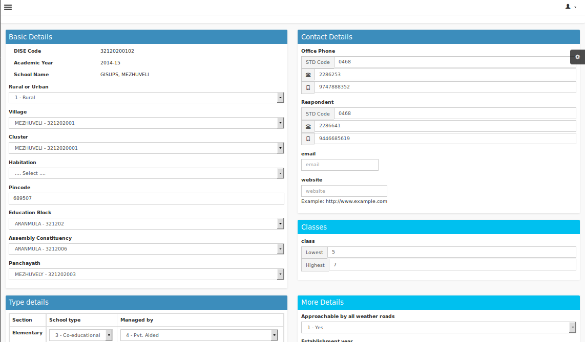

# School Particulars
----

Form for filling basic details of School. School Code, School name and academic
year will be displayed automaticaly. The user can select and fill all other details regarding School like Rural or Urban, Village, Cluster, Habitation, Pincode,
 Education Block, Assembly constituency and Panchayath etc. 

