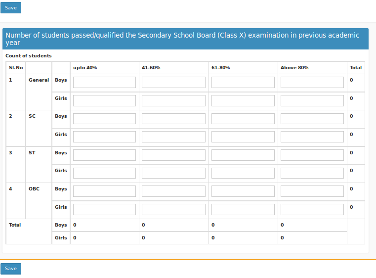

## Number of students passed/qualified the Secondary School Board (Class X) Examination (in previous academic year)

Form used to enter the number of students passed/qualified the Class X in previous academic year.

